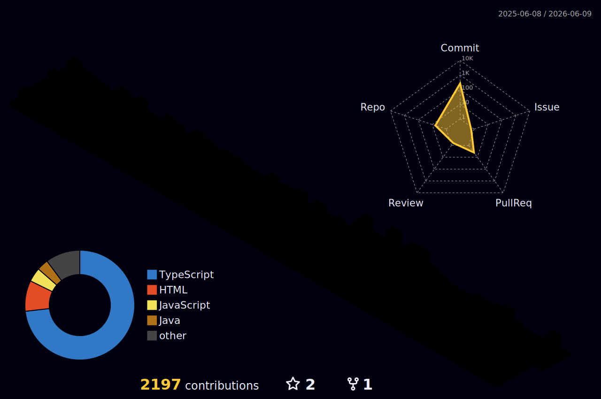

# 💫 About Me:
👋 Hi there! I'm João Vitor!  🎓 I'm currently studying Software Engineering at UTFPR and building real-world experience as a Fullstack Developer intern at CNA+.  🚀 I’ve been developing GrapqhQL APIs with Node.js, Express, TypeORM, PostgresSQL and events managed by Kafka, working on system CRM platform to franchisors. In this year (2026), I'm in Unect. Jr as CTO, that gives me a estrategical vision and business skills to complement my graduation.  🛠️ I'm passionate about clean code, scalable systems, and turning real problems into elegant tech solutions.

# 💻 Tech Stack:
            

## 🌐 Socials:
  

