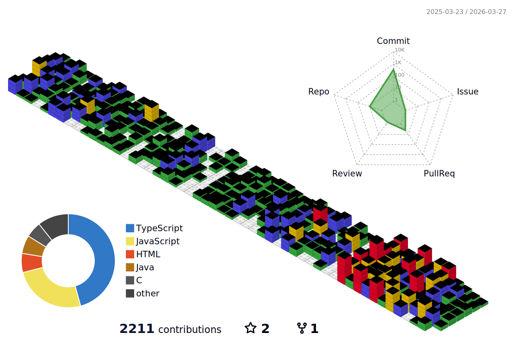

# 💫 About Me:
👋 Hi there! I'm João Vitor!  🎓 I'm currently studying Software Engineering at UTFPR and building real-world experience as a Back-End Developer trainee at Unect Jr., the junior enterprise of UTFPR.  🚀 I’ve been developing RESTful APIs with Node.js, Express, MongoDB (Mongoose), and JWT authentication, working on systems like pet adoption platforms and financial automation tools. I also collaborate on full-stack projects — including landing pages — using HTML, CSS, JavaScript, and Git/GitHub.  🛠️ I'm passionate about clean code, scalable systems, and turning real problems into elegant tech solutions.

## 🌐 Socials:
  

# 💻 Tech Stack:
            
# 📊 GitHub Stats:
 
 

### 🔝 Top Contributed Repo

